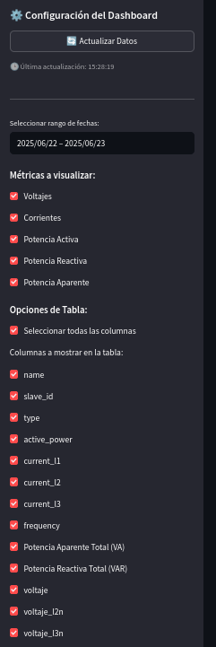
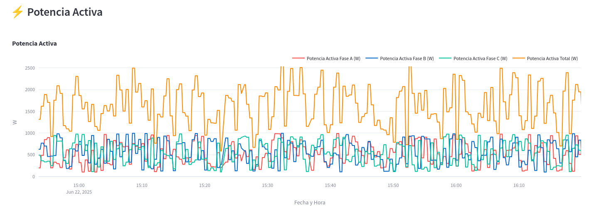
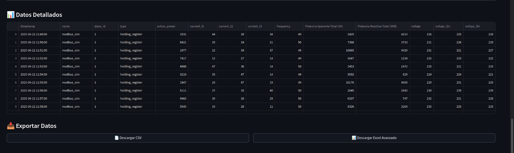
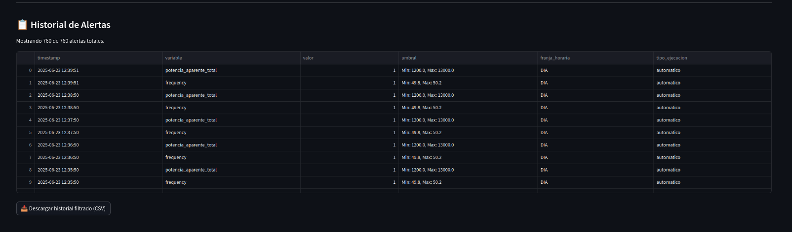
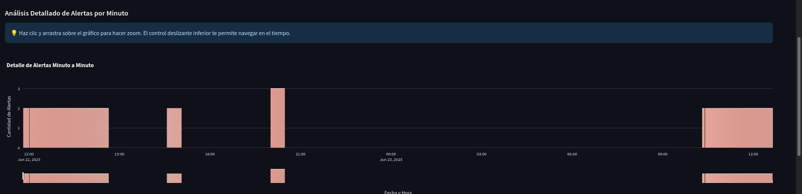
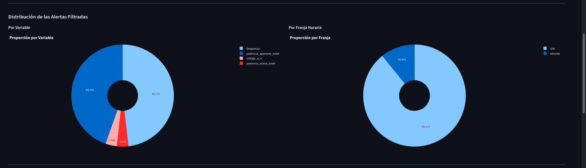
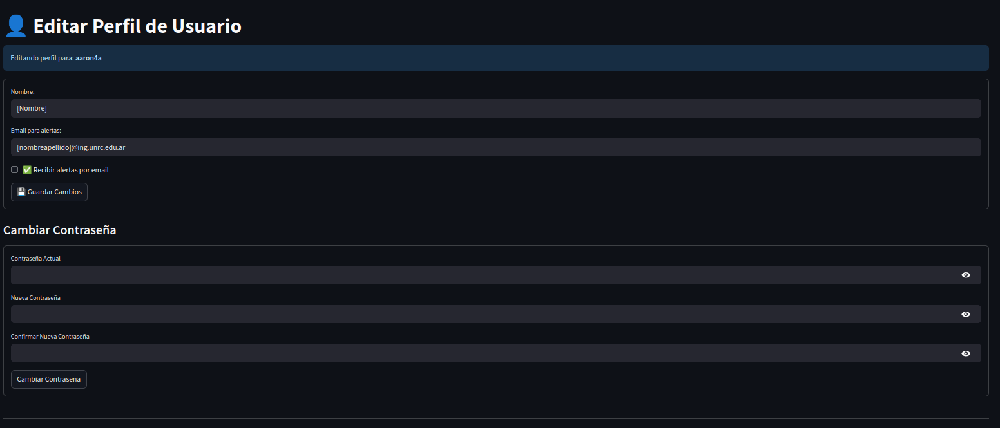
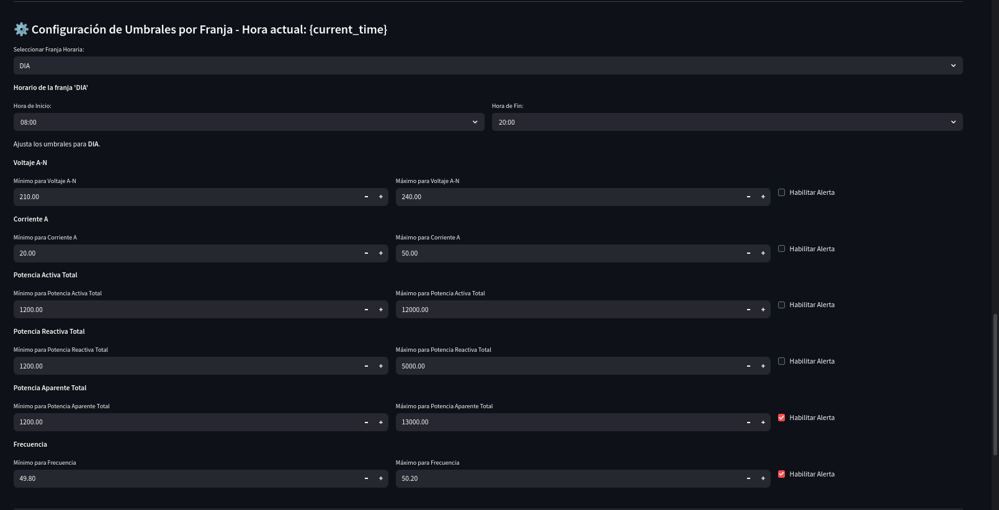
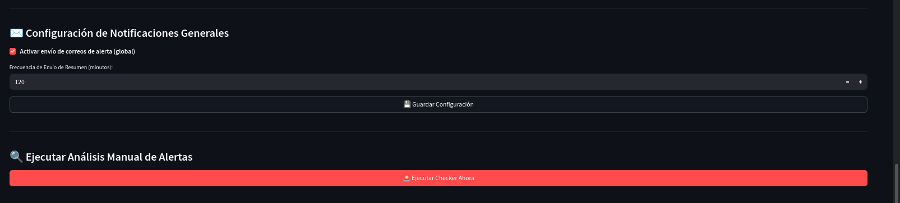
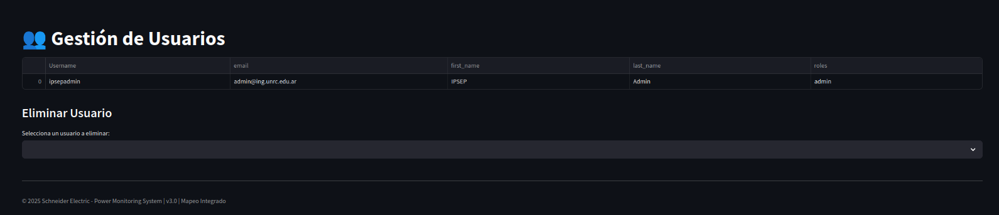

# Aplicación

La aplicación acepta dos tipos de usurios, los de rol Normal y de Administrador. El usuario Administrador tendrá la opción de, además de visualicación y descargar información como los de rol Normal, setear parámetros de alertas y configurar usuarios de rol Normal.

## Rol Normal

Al ingresar como nuevo usuario registrado, cualquiera que no sea el administrador, podrá acceder a las funcionalidades mostradas en éste apartado.

A la izquierda se puede observar una barra con éstos contenidos:

Se muestra el Usuario con el que se ingresó y su Rol. También podemos cerrar sesión desde el botón debajo de Rol y se pueden navegar en tres pestañas distintas apretando el circulo a su dercha : 

- **Dashboard Principal** : 
    Se expande la barra lateral con las opciones mostradas en la imagen debajo.
    
    

    `Actualizar Datos` permite recargar los Dashboards con nueva información

    Se puede seleccionar el rango de fechas a querer visualizar en `Seleccionar rango de fechas`

    `Métricas a visualizar` permite elegir los dashboards que se quieren mostrar.

    En `Columnas a mostrar en la tabla` podemos elegir la información de los parámetros que se mostrarán en la tabla al final de la página.     

    En la página principal podremos ver los dashboards seleccioandos, los cuales son interactivos y permiten hacer zoom :

    

    Arriba a la derecha de cada dashboard se encuentran las diferentes medidas de cada parametro por fase y total. Podemos seleccionar, al apretar cada linea de color, si queremos que se vea en el dashboard o no.  

    Al final de la paǵina encontraremos los siguientes apartados :

    

    Aquí se pueden observar los datos en un formato parecido a Excel con sus propias estampas de tiempo. Podremos descargar ésta información tanto en formato `.csv` como `Excel`.

- **Alertas y Logs** : 
    
    Aquí se pueden observar diferentes parámetros de alerta y registro de las mismas, elgigiendo en la barra lateral la franja de visualización de alertas.

    `Historial de alertas` 
    

    Muestra las alertas referentes a una variable, el momento en el que sucedió, el valor, el valor seteado de umbral que superó para que salte la alarma y la franja horaria en la que sucedió.

    `Análisis Detallado de Alertas por Minuto`
    

    Dashboard que permite navegar en el tiempo para ver la cantidad de alertas generadas y cuando fueron generadas.

    `Distribución de las Alertas Filtradas`
    

    Se muestran gráficos de porcentajes,por variable y por franja horaria, en los cuales se ven las proporciones de los parámetros con alerta y las franjas horarias de ocurrencia.

    `Configuración de Umbrales por Franja - Hora actual`
    Los usuarios de rol Normal no pueden realizar cambios en ésta sección, pero pueden observarla.

- **Editar Perfil**

    Aquí se puede editar la información del usuario que ingresa.
    
    

    Se ingresa el nombre y el email al cual se quieren enviar alertas en caso de querer hacerlo.

    Por otro lado, se puede cambiar la contraseña ingresando la actual.

## Rol Administrador

El administrador tendrá las mismas prestaciones de un usuario normal, con las siguientes opciones extras : 

- **Alerta y Logs**
    
    Al fondo de la página, tendrá la opción de configurar las alarmas que se van a enviar, por parámetro.

    

    Allí seleccionamos la franje horaria de las alarmas, el horario de dicha franja, los máximos y mínimos de cada parámetro y la posibilidad de activar sus alarmas o no.

    También en el mismo apartado se puede seleccionar la frecucencvia de envío de resumenes de alertas en minutos.

    

- **Gestión de usuarios**

    Al usuario administrador se le agrega esta opción extra en la barra lateral, la cual al abrirla se ve de la siguiente manera :

    

    Aquí el administrador puede ver TODOS los usuarios registrados con su información principal y debajo tiene la opción de eliminarlos.
    

    

    

