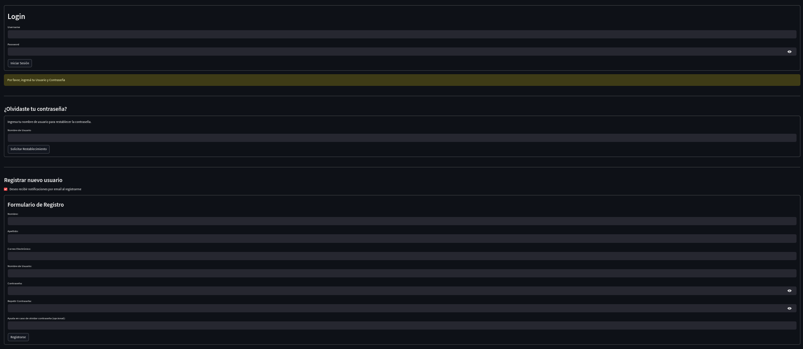
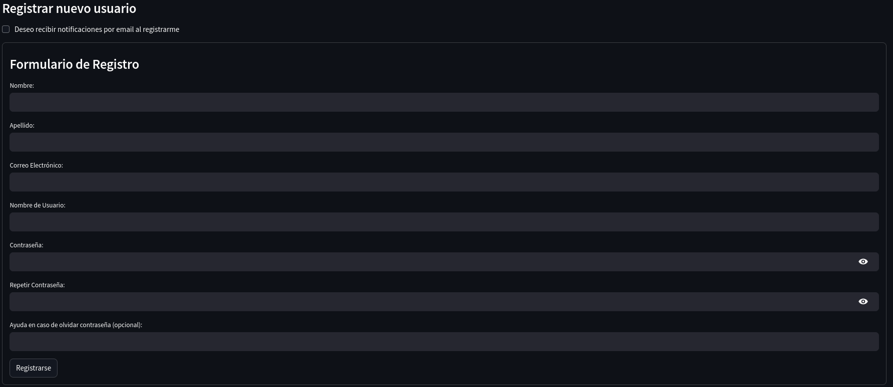
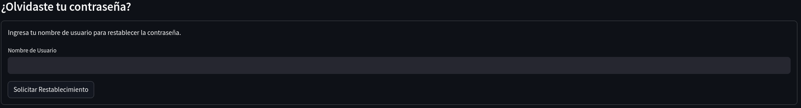
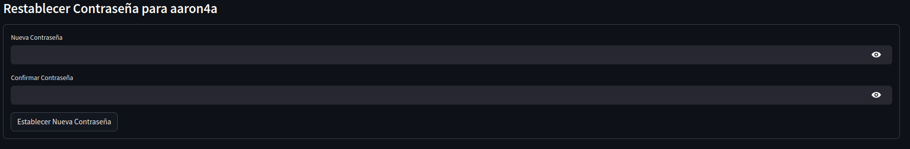
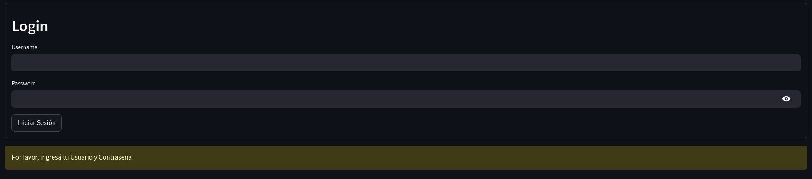

# Registro e Inicio de Sesión

## Acceso a la aplicación
Para acceder a la aplicación Visualizador de variables de equipo Power Logic Circuit Monitor Series 4000, se debe insertar en la sección de URL del navegador alguno de los siguientes links :

* **<http://localhost:8501>**
* 

De ésta forma accedemos a la sección de Login(Inicio de Sesión), recuperación de contraseña y registro de nuevo usuario como se muestra en la imagen de abajo.



## Registrar nuevo usuario

Para poder acceder a las funcionalidades de la aplicación, un nuevo usuario debe resgistrarse. El único que no debe hacerlo es el `Admin`, el cual es un usuario que se provee al profesor responsable que controle el acceso a la propia aplicación.

El formulario de registro es el siguiente :



Se debe rellenar los siguientes datos y se aclaran particularidades de ser necesario :

- `Nombre` : Nombre del usuario a registrarse
- `Apellido` : Apellido del usuario a registrarse
- `Correo Electrónico` : Debe ser institucional del tipo **@ing.unrc.edu.ar**.
- `Nombre de usuario` : Debe estar en minúscuas y puede poseer números.
- `Contraseña` : Debe poseer, al menos, mayúsculas, minúsculas, números y caracteres especiales (como "?", "!", "%")
- `Repertir contraseña` : Se inserta la misma contraseña que en el item anterior.
- `Ayuda en caso de olvidar la contraseña (opcional)` : NO UTILIZAR.
- `Deseo recibir notificaciones por email al registrarme` : Acceso a recibir mails en caso de que se generen alertas en el sistema.

## Recuperar contraseña

En el caso de haberte registrado y no recordar la contraseña, podemos acceder a ésta opción que nos permite
recuperarla enviando un email al mail utilizado para el registro.




Ésto nos envía un mail con el siguiente contenido :

```
Hola [nombre de usuario],

Hemos recibido una solicitud para restablecer la contraseña de tu cuenta.

Haz clic en el siguiente enlace para establecer una nueva contraseña:

http://localhost:8501/?token=[caracteres alfa numéricos]

Si no solicitaste un restablecimiento de contraseña, ignora este correo electrónico.

Este enlace es válido por un tiempo limitado.

Gracias,
El equipo de PowerLogic Monitor
```

Al hacer click sobre ése link, nos redirecciona a una pestaña donde podremos ingresar la nueva contraseña :


## Inicio de sesión

Para ingresar a la aplicación principal, ingresamos el nombre de usuario y contraseña registrados.




