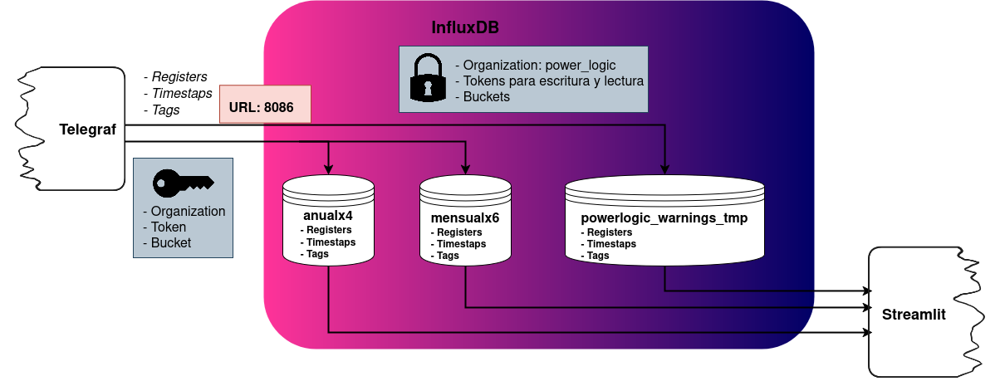

# InfluxDB Configuration

Este directorio contiene los scripts y configuraciones relacionadas con la base de datos InfluxDB 2.x utilizada en el sistema de monitoreo.

## Esquema de Arquitectura de InfluxDB

A continuación se muestra un diagrama que ilustra la arquitectura y el flujo de datos entre Telegraf, los buckets de InfluxDB y la aplicación Streamlit:



## Propósito

InfluxDB es una base de datos de series temporales (TSDB) optimizada para el almacenamiento y consulta de grandes volúmenes de datos con marca de tiempo, como los generados por sensores y dispositivos de monitoreo. En este proyecto, InfluxDB es el corazón del almacenamiento de datos eléctricos.

## Estructura del Directorio

influxdb/
└── init.sh     # Script de inicialización de InfluxDB
└── README.md   # Este archivo


## `init.sh`

### Propósito

El script `init.sh` es un script de shell crucial que se ejecuta una vez cuando el contenedor de InfluxDB se inicia por primera vez (o cuando su volumen de datos está vacío). Su función principal es preparar el entorno de InfluxDB para que el resto del sistema pueda interactuar con él correctamente.

### Análisis Línea por Línea y Lógica

```bash
#!/bin/sh
set -e
#!/bin/sh: Shebang, indica que el script debe ser ejecutado por sh.
set -e: Si algún comando falla, el script terminará inmediatamente. Esto previene que el script continúe con configuraciones erróneas si una etapa anterior falla.
Bash
INFLUX_URL=http://influxdb:8086
ORG=power_logic
TOKEN=token_telegraf
Define variables de shell con la URL de InfluxDB, la organización (ORG) y el token de administración inicial (TOKEN). Estos valores deben coincidir con los definidos en el docker-compose.yml para la configuración inicial de InfluxDB.
Bash
# Esperar a que Influx esté listo
until influx ping --host $INFLUX_URL > /dev/null 2>&1; do
  echo "⏳ Esperando a InfluxDB..."
  sleep 2
done
Este es un bucle until que espera a que el servicio InfluxDB esté completamente operativo y respondiendo.
influx ping --host $INFLUX_URL: Envía una solicitud de ping a InfluxDB.
> /dev/null 2>&1: Redirige la salida estándar y de error a /dev/null para que no se muestre en la consola (silencioso).
sleep 2: Pausa el script por 2 segundos antes de reintentar si el ping falla.
Bash
# Crear bucket 'anualx4' si no existe
if ! influx bucket list --org "$ORG" --host "$INFLUX_URL" --token "$TOKEN" | grep -q anualx4; then
  echo "📦 Creando bucket 'anualx4'..."
  influx bucket create --name anualx4 --retention 1460d --org "$ORG" --host "$INFLUX_URL" --token "$TOKEN"
else
  echo "✅ Bucket 'anualx4' ya existe."
fi
Lógica: Verifica si el bucket anualx4 ya existe.
influx bucket list ... | grep -q anualx4: Lista los buckets y busca el nombre anualx4. grep -q (quiet mode) no imprime nada y solo retorna un código de salida (0 si encuentra, 1 si no).
if ! ...; then: Si grep NO encuentra el bucket (! niega el resultado), entonces procede a crearlo.
influx bucket create --name anualx4 --retention 1460d --org "$ORG" --host "$INFLUX_URL" --token "$TOKEN": Crea el bucket anualx4 con una política de retención de 1460 días (4 años).
Bash
# Crear bucket temporal para alertas si no existe
if ! influx bucket list --org "$ORG" --host "$INFLUX_URL" --token "$TOKEN" | grep -q powerlogic_warnings_tmp; then
  echo "📦 Creando bucket 'powerlogic_warnings_tmp'..."
  influx bucket create --name powerlogic_warnings_tmp --retention 1d --org "$ORG" --host "$INFLUX_URL" --token "$TOKEN"
else
  echo "✅ Bucket 'powerlogic_warnings_tmp' ya existe."
fi
Lógica: Similar al anterior, pero crea el bucket powerlogic_warnings_tmp con una política de retención de 1 día. Este bucket es fundamental para la recolección de datos de alta frecuencia para el sistema de alertas.
Bash
# Crear secreto ejemplo (Comentado o mantener si es para otros fines)
influx secret update --key TOKEN_EXTRA --value otro_token \
  --org "$ORG" --host "$INFLUX_URL" --token "$TOKEN"
Este bloque muestra un ejemplo de cómo se podría crear o actualizar un secreto en InfluxDB. Es poco probable que sea esencial para la funcionalidad central actual.
Bash
# Crear token RW
influx auth create \
  --org "$ORG" \
  --read-buckets --write-buckets \
  --token "token_lectura_escritura" \
  --description "Token RW buckets" \
  --host "$INFLUX_URL" --token "$TOKEN" || echo "⚠️ Token ya existe."
Lógica: Crea un token de autenticación en InfluxDB llamado token_lectura_escritura. Este token tiene permisos de lectura y escritura para todos los buckets (--read-buckets --write-buckets) dentro de la organización especificada. Es un token general que podría ser usado por otras aplicaciones si necesitaran más permisos que los de token_telegraf.
|| echo "⚠️ Token ya existe.": Si el comando influx auth create falla (probablemente porque el token ya existe), imprimirá una advertencia en lugar de detener el script.
Bash
echo "✅ Script de inicialización completado."
exit 0
Mensaje final y código de salida exitoso.
Flujo de Funcionamiento (influxdb y influxdb-init):
El servicio influxdb se inicia y comienza a arrancar la base de datos InfluxDB.
El servicio influxdb-init espera hasta que influxdb esté completamente listo y respondiendo a los pings.
Una vez que influxdb está operativo, influxdb-init ejecuta el script init.sh.
init.sh procede a verificar y crear los buckets anualx4 (para datos a largo plazo) y powerlogic_warnings_tmp (el bucket temporal para alertas) si no existen.
También crea un token de lectura/escritura adicional si no existe.
